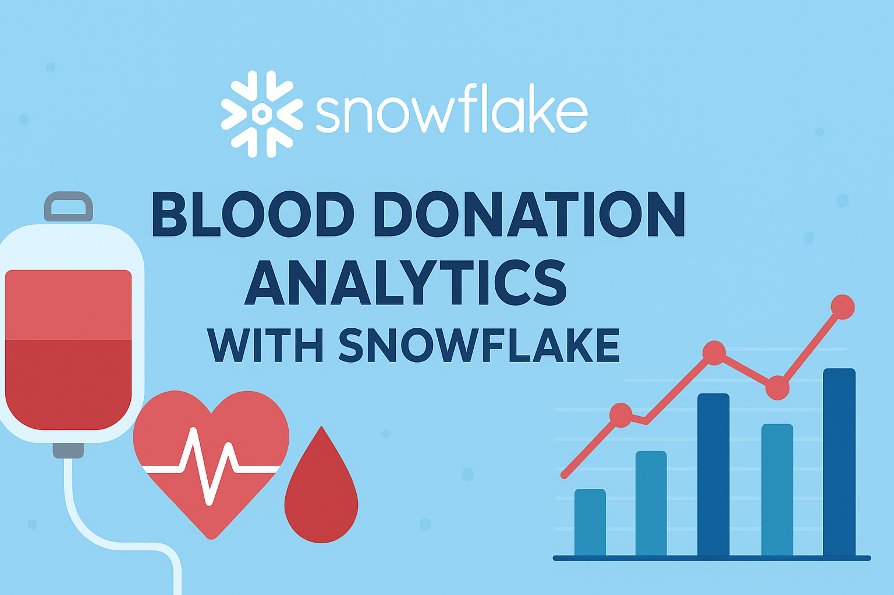

<p align="center">
  
</p>


  
  
  
  

This project demonstrates how to build a **Snowflake + Python analytics pipeline** using synthetic donor and transfusion datasets. It covers data ingestion, SQL analytics, and Python visualization.  

---

## 🚀 Project Overview
- **Data**: Synthetic dataset of donors and transfusions (~1000 records)  
- **Storage & Query**: Snowflake for database and SQL analytics  
- **Visualization**: Python (Matplotlib / Seaborn)  

---

## 📂 Project Structure
```

blood\_donation\_snowflake/
│
├── data/                      # CSV files for donors & transfusions
├── sql/                       # SQL scripts (create tables, queries)
├── python/                    # Python scripts for visualization
├── images/                    # Generated charts (results)
│   ├── donors\_per\_blood\_type.png
│   └── donations\_over\_time.png
├── requirements.txt           # Python dependencies
└── README.md

````

---

## 🛠️ Setup Instructions

1. **Clone Repository**  
   ```bash
   git clone https://github.com/your-username/blood_donation_snowflake.git
   cd blood_donation_snowflake
````

2. **Install Dependencies**

   ```bash
   pip install -r requirements.txt
   ```

3. **Snowflake Setup**

   * Create a database and schema in Snowflake
   * Run `sql/create_tables.sql` to create tables
   * Load `data/donors.csv` and `data/transfusions.csv` into Snowflake

4. **Run Analytics Queries**
   Example: Total donors per blood type

   ```sql
   SELECT blood_type, COUNT(*) AS total_donors
   FROM donors
   GROUP BY blood_type
   ORDER BY total_donors DESC;
   ```

5. **Python Visualization**

   * Update your Snowflake credentials in `python/visualize.py`
   * Run:

     ```bash
     python python/visualize.py
     ```
   * Charts will be saved into the `images/` folder

---

## 📊 Example Results

### Donors per Blood Type


### Donations Over Time


---

## 🎯 Key Learnings

* Loading structured data into Snowflake
* Writing SQL for aggregation and reporting
* Connecting Snowflake to Python for analytics
* Visualizing healthcare data with charts

---

## 📌 Future Improvements

* Add dashboard integration (Power BI / Tableau)
* Implement role-based access in Snowflake
* Explore ML use cases (predict donor retention)

---

## 👩‍💻 Author

M.Yavari — [LinkedIn](www.linkedin.com/in/marzieh-yavari-1ab66671) | [GitHub](https://github.com/yavarim21)

